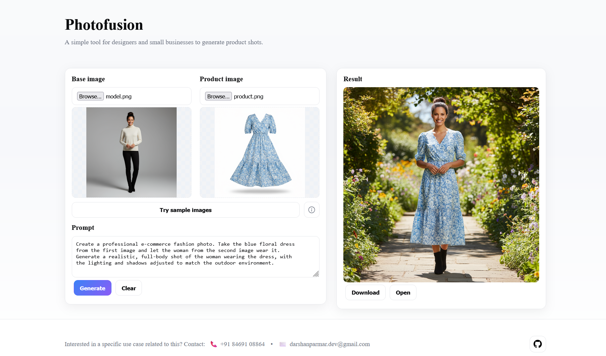

# Image Fusion (Next.js on Vercel)

A Next.js app that lets users upload a base image and a product image, enter a prompt, and returns a fused image generated by Gemini 2.5 Flash Image (preview).

Deploy
- Set `GOOGLE_API_KEY` in Vercel Project → Settings → Environment Variables.
- Build command: `npm run build`

Local dev (Windows CMD)
```
cd /d d:\Work\Projects\ImageFusion
npm install
set GOOGLE_API_KEY=YOUR_KEY_HERE && npm run dev
```
Open http://localhost:3001

Notes
- API route: `app/api/fuse/route.ts` (Node.js runtime) — reads formData, calls Gemini, returns image bytes.
- UI: `app/page.tsx` — uploads images, shows previews, handles 429 retry, displays result with download.
- Model: `gemini-2.5-flash-image-preview` (preview name may change as the model stabilizes).
- Request size limits: If images are large, consider client-side downscaling before upload.

## Example

Prompt

```
Create a professional e-commerce fashion photo. Take the blue floral dress
from the first image and let the woman from the second image wear it.
Generate a realistic, full-body shot of the woman wearing the dress, with
the lighting and shadows adjusted to match the outdoor environment.
```

Inputs

- Base image

	

- Product image

	

Output


